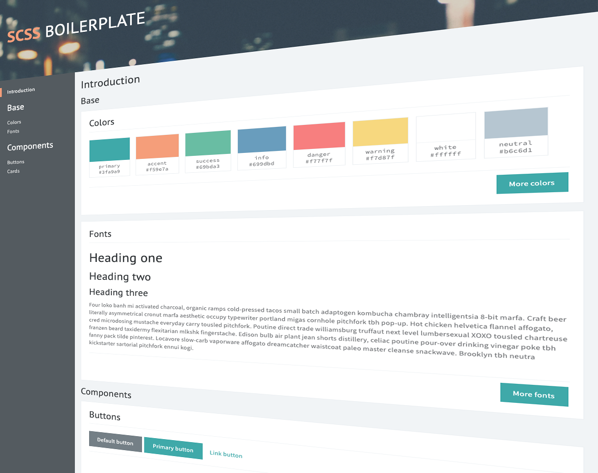

# SCSS boilerplate

This project contains SCSS files which may be used as boilerplate styles
for a responsive web application. In addition, there are component demo
pages to preview the application component styles.

## Folder structure

<pre>
<strong>demo/</strong>
HTML pages which demonstrate various component styles.

<strong>styles/</strong>
Some useful functions and mixins, variable maps with their accessor
functions, as well as component styles.

    <strong>abstracts/</strong>
    functions, mixins

    <strong>base/</strong>
    colors, fonts, theme

    <strong>layouts/</strong>
    global, header, main

    <strong>modules/</strong>
    cards, code, titles

    <strong>pages/</strong>
    demo

    <strong>vendor/</strong>
    bootstrap
    
<strong>boilerplate.scss</strong>
All of the above files imported.

<strong>boilerplate.css</strong>
All of the above files compiled.
</pre>

## How to get started

To preview the initial component styles, open
<code>demo/index.html</code> in a web browser.

## How to customize

To customize the default colors, fonts, and various other component
styles, edit the corresponding SCSS files directly and run the following
command in the project directory:

<pre>
sass --watch styles
</pre>

<small>Note: If the about sass command is not recognized, run
<code>npm install -g sass</code></small>

This will recompile SCSS files in the <code>styles/</code> directory and
will continue watching for any other style changes. To stop watching,
press <code>ctrl+c</code>.

Preview your changes by opening <code>demo/index.html</code> in a web
browser.
